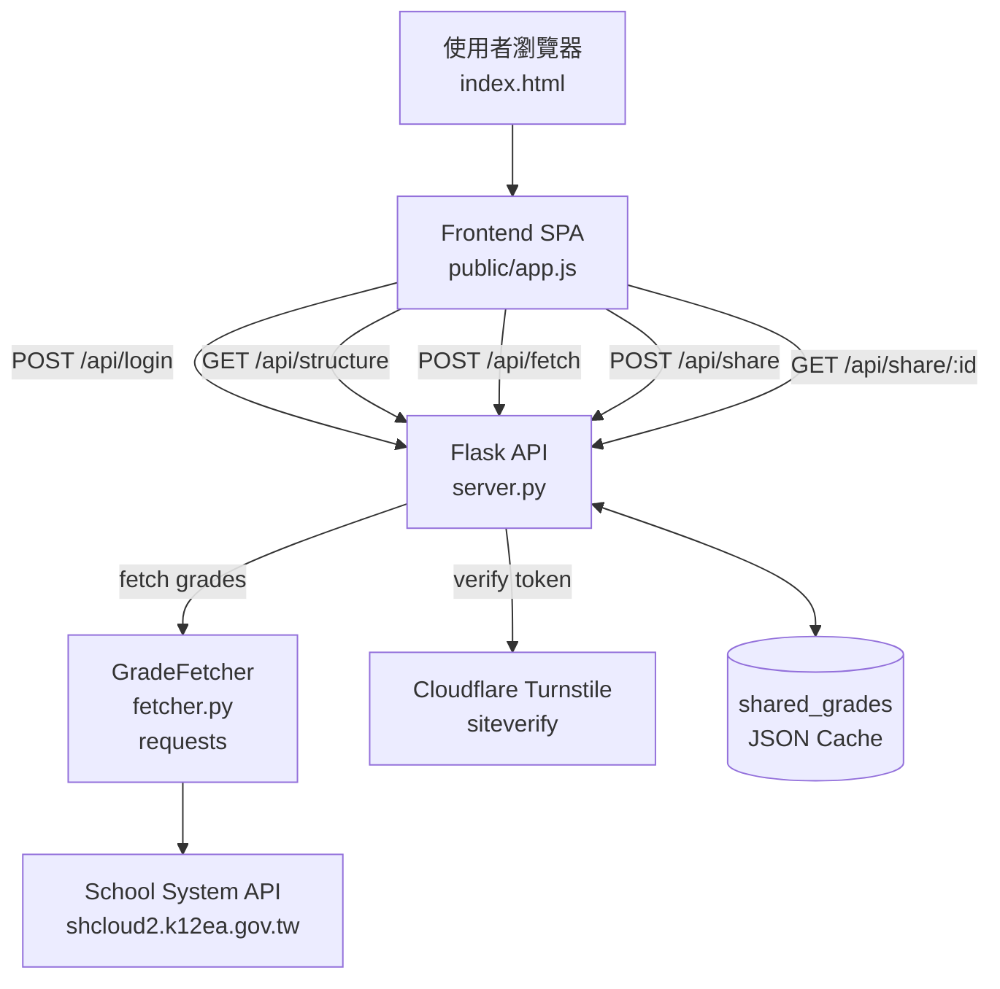
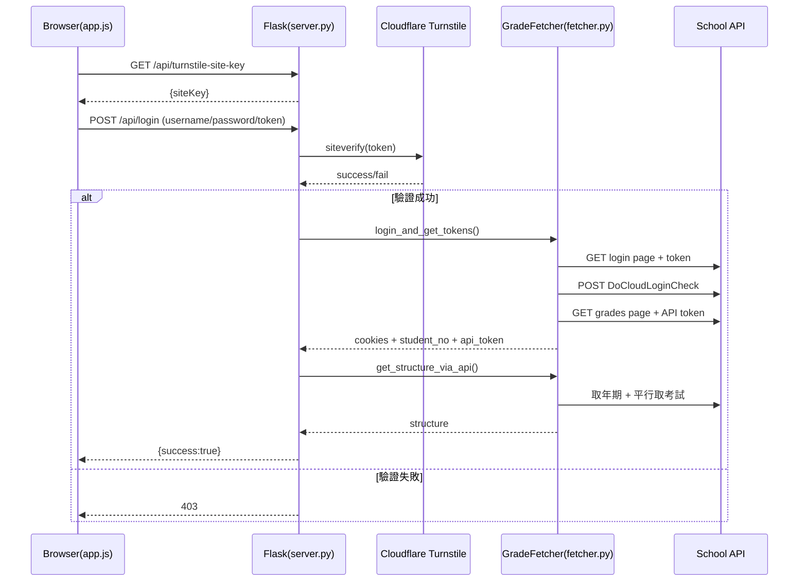
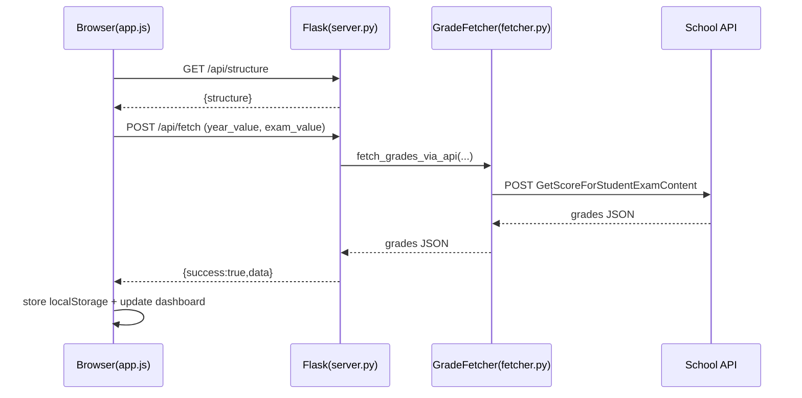
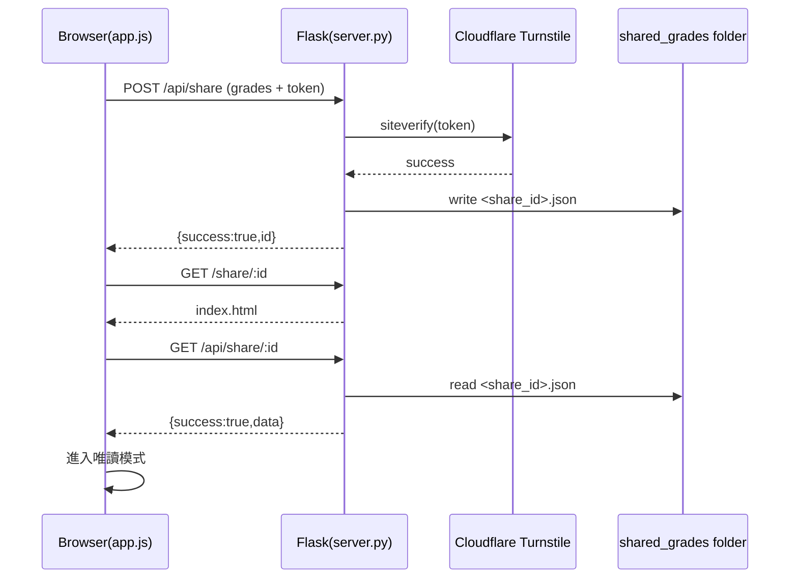

# 專案架構與前後端溝通說明

本文件補充本專案的完整系統架構、API 規格，以及登入/查詢/分享三大流程的時序圖。

## 1) 系統架構圖（Mermaid）



## 2) 元件分層與責任

| 層級 | 元件 | 責任 |
|---|---|---|
| 前端呈現層 | `public/index.html`, `public/style.css` | 提供儀表板、Modal、分享 UI。 |
| 前端邏輯層 | `public/app.js` | API 呼叫、表單互動、localStorage、圖表渲染、分享頁唯讀模式。 |
| API 層 | `server.py` | 路由、Session、Turnstile 驗證、分享檔案讀寫、靜態檔案服務。 |
| 整合層 | `fetcher.py` | 以 requests 登入學校系統並抓取結構/成績。 |
| 外部服務 | 學校系統、Cloudflare | 資料來源與人機驗證。 |
| 佈署層 | `Dockerfile`, `docker-compose.yml` | Gunicorn 啟動、健康檢查、cloudflared tunnel。 |

## 3) 前後端 API 規格

> Base URL: https://score.clhs.dev

### 3.1 安全驗證與登入

#### `GET /api/turnstile-site-key`
- **用途**：取得前端初始化 Turnstile 的 site key。
- **回應 200**
```json
{ "siteKey": "<TURNSTILE_SITE_KEY or empty>" }
```

#### `POST /api/login`
- **用途**：登入學校系統，建立後端 session。
- **Request JSON**
```json
{
  "username": "學號",
  "password": "密碼",
  "cf-turnstile-response": "token"
}
```
- **回應 200**
```json
{ "success": true, "message": "登入成功" }
```
- **回應 400/401/403/500**
```json
{ "success": false, "message": "錯誤訊息" }
```

#### `GET /api/check_login`
- **用途**：確認當前 session 是否已登入。
- **回應 200**
```json
{ "logged_in": true }
```
- **回應 401**
```json
{ "logged_in": false }
```

#### `POST /api/logout`
- **用途**：清除 session。
- **回應 200**
```json
{ "success": true, "message": "已登出" }
```

### 3.2 成績查詢

#### `GET /api/structure`
- **用途**：取得「學年度/學期」與可查詢考試清單。
- **Query**：`reload=true`（可選，強制重抓）
- **回應 200**
```json
{
  "structure": {
    "113學年度第2學期": {
      "year_value": "113_2",
      "exams": [
        { "text": "第一次段考", "value": "1" },
        { "text": "第二次段考", "value": "2" }
      ]
    }
  }
}
```
- **回應 401**
```json
{ "error": "錯誤訊息" }
```

#### `POST /api/fetch`
- **用途**：查詢指定學期與考次的成績資料。
- **Request JSON**
```json
{
  "year_value": "113_2",
  "exam_value": "2"
}
```
- **回應 200**
```json
{
  "success": true,
  "message": "成績已更新",
  "data": {
    "Result": {
      "StudentName": "王小明",
      "StudentNo": "123456",
      "StudentClassName": "三年甲班",
      "SubjectExamInfoList": []
    }
  }
}
```
- **回應 401/500**
```json
{ "success": false, "error": "錯誤訊息" }
```

### 3.3 分享機制

#### `POST /api/share`
- **用途**：將前端成績 JSON 產生分享連結。
- **Request JSON**：任意成績資料（需包含前端使用資料），且附帶 `cf-turnstile-response`。
```json
{
  "Result": {},
  "cf-turnstile-response": "token"
}
```
- **回應 200**
```json
{ "success": true, "id": "Abc12-Def34_Gh~" }
```
- **回應 400/403/500**
```json
{ "error": "錯誤訊息" }
```

#### `GET /api/share/:share_id`
- **用途**：讀取分享資料。
- **回應 200**
```json
{ "success": true, "data": { "Result": {} } }
```
- **回應 400/404/500**
```json
{ "error": "Invalid ID format or Link expired or not found" }
```

#### `GET /share/:share_id`
- **用途**：回傳前端頁面（由前端再呼叫 `/api/share/:share_id` 載入唯讀資料）。

### 3.4 其他

#### `POST /api/upload`
- **用途**：上傳 JSON 檔或直接送 JSON；檢查是否含 `Result`。
- **回應 200**
```json
{ "success": true, "data": { "Result": {} } }
```

#### `GET /health`
- **用途**：健康檢查。
- **回應 200**
```json
{ "status": "ok" }
```

## 4) 核心流程時序圖（Mermaid）

### 4.1 登入 + 預抓結構



### 4.2 查詢成績



### 4.3 分享與唯讀檢視



## 5) 佈署與執行摘要

- `Dockerfile` 使用 `python:3.11-slim`，安裝依賴後以 `gunicorn` 啟動 `server:app`（5000 port）。
- `docker-compose.yml`：
  - `app` 服務掛載 `./shared_grades:/app/shared_grades`。
  - 健康檢查透過 `GET /health`。
  - `tunnel` 服務使用 `cloudflare/cloudflared` + `TUNNEL_TOKEN`。

## 6) 重要注意事項

- 後端將登入狀態保存在 Flask session（cookie-based session + server-side secure key）。
- `SESSION_COOKIE_SECURE=True`，部署需 HTTPS。
- `shared_grades` 檔案有背景清理機制：每 10 分鐘掃描，2 小時過期刪除。
- 前端會將最近一次查詢成績存放在 `localStorage.gradesData`，以提升重開頁面體驗。
