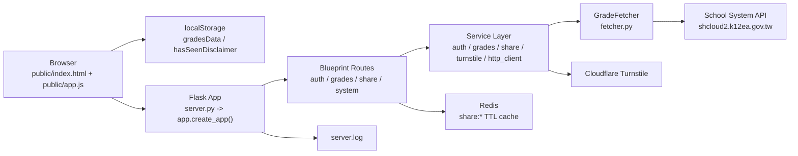
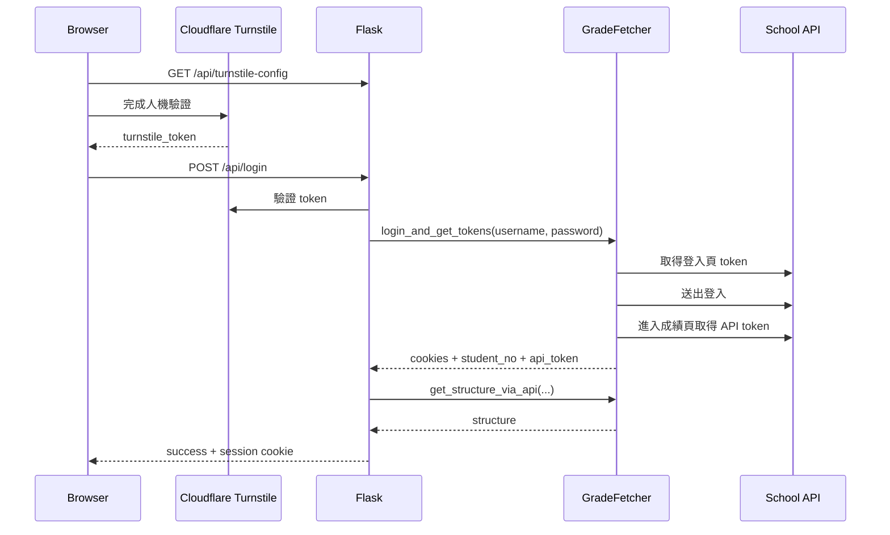

# 專案架構文件

> 本文件依 2026-03-10 的程式碼現況整理。若與舊版 README、舊部署筆記或歷史截圖不一致，以目前程式碼為準。
>
> 舊版文件最容易誤導的地方有兩個：
> 1. 分享資料現在是存放在 Redis，並使用 TTL 自動過期，不再以 `shared_grades/*.json` 作為主要儲存方式。
> 2. 後端已明確拆成 `app/routes` 與 `app/services`，而不是所有流程都集中在單一入口檔。

## 1. 專案定位

這個專案是一個面向學生的成績分析網站，核心目標不是自行維護成績資料，而是：

- 由前端提供成績視覺化儀表板。
- 由 Flask 後端代理登入學校系統並抓取成績資料。
- 將成績資料轉成更容易閱讀的圖表、排名與分布資訊。
- 提供短時效、唯讀的分享連結。

這是一個「前端 SPA + Flask API + 外部校務系統整合」的專案，沒有自己的關聯式資料庫，也沒有背景工作排程。

## 2. 系統總覽



### 2.1 主要元件

| 元件 | 位置 | 職責 |
|---|---|---|
| 前端頁面 | `public/index.html`, `public/style.css` | 呈現儀表板、登入/查詢/分享 modal、唯讀分享畫面。 |
| 前端邏輯 | `public/app.js` | 載入/驗證成績資料、呼叫 API、Chart.js 視覺化、localStorage 快取、分享模式切換。 |
| Flask 入口 | `server.py`, `app/__init__.py` | 建立 Flask app、注入設定、註冊 blueprints、初始化 CORS/Logger/Redis。 |
| Route 層 | `app/routes/*.py` | 處理 HTTP request/response、session 讀寫、錯誤碼、靜態檔回應。 |
| Service 層 | `app/services/*.py` | 封裝登入、成績抓取、分享、Turnstile 驗證、HTTP client 設定。 |
| 外部整合層 | `fetcher.py` | 與學校平台互動，處理 hidden token、cookies、API token、考試結構與成績抓取。 |
| 暫存儲存 | Redis | 保存分享連結內容，2 小時過期。 |
| 外部服務 | 學校系統、Cloudflare Turnstile | 前者提供真實成績資料，後者負責人機驗證。 |

## 3. 專案目錄與模組責任

```text
.
├─ server.py
├─ fetcher.py
├─ Dockerfile
├─ docker-compose.yml
├─ requirements.txt
├─ public/
│  ├─ index.html
│  ├─ app.js
│  ├─ style.css
│  ├─ privacy.html
│  └─ 其他靜態資產
├─ app/
│  ├─ __init__.py
│  ├─ extensions.py
│  ├─ routes/
│  │  ├─ auth.py
│  │  ├─ grades.py
│  │  ├─ share.py
│  │  └─ system.py
│  └─ services/
│     ├─ auth_service.py
│     ├─ grades_service.py
│     ├─ share_service.py
│     ├─ turnstile_service.py
│     └─ http_client.py
└─ docs/
   └─ ARCHITECTURE.md
```

### 3.1 入口與初始化

- `server.py`
  - 啟動點，只做兩件事：`create_app()` 與本機開發模式下的 `app.run(...)`。
  - 本機直接啟動時會開 `debug=True`。
- `app/__init__.py`
  - 建立 Flask app factory。
  - 設定 `SECRET_KEY`、session cookie 屬性、Redis client、Turnstile key、CORS、ProxyFix。
  - 將 `GradeFetcher` 注入 `app.config['GRADE_FETCHER']`，讓 routes 透過設定取得依賴。

### 3.2 Route 層

| 檔案 | 路由 | 責任 |
|---|---|---|
| `app/routes/auth.py` | `/api/login`, `/api/check_login`, `/api/logout` | 登入、登入狀態檢查、登出、登入後預抓結構。 |
| `app/routes/grades.py` | `/api/structure`, `/api/fetch` | 取得學年/考試結構、抓取指定考試成績。 |
| `app/routes/share.py` | `/api/share`, `/api/share/<id>`, `/share/<id>` | 建立分享連結、讀取分享內容、提供分享頁入口。 |
| `app/routes/system.py` | `/`, `/<path:filename>`, `/health`, `/api/turnstile-config` | SPA 入口、靜態檔案、健康檢查、Turnstile site key。 |

### 3.3 Service 層

| 檔案 | 責任 |
|---|---|
| `auth_service.py` | 封裝登入結果，組合 session payload。 |
| `grades_service.py` | 提供成績結構與成績抓取的薄封裝。 |
| `share_service.py` | 產生 share id，對 Redis 做 JSON 存取。 |
| `turnstile_service.py` | 向 Cloudflare 驗證 token；若未設定 secret key，視為本機開發模式直接放行。 |
| `http_client.py` | 建立帶 timeout、retry、backoff 的 `requests.Session`。 |

### 3.4 外部整合層

`fetcher.py` 是目前最接近「adapter / integration」的模組，負責：

- 先打學校登入頁，解析 `__RequestVerificationToken`。
- 送出登入表單，取得登入後 cookies。
- 再進入成績頁，取得 API 專用 token。
- 呼叫校務系統 API 抓取：
  - 可查詢的學年學期清單
  - 各學年可查詢的考試清單
  - 特定考試的成績 JSON

其中 `get_structure_via_api()` 會使用 `ThreadPoolExecutor` 平行抓各學期的考試清單，以縮短查詢結構的等待時間。

## 4. 前端架構

前端不是模板渲染頁，而是以單一 `index.html` 為入口、由 `public/app.js` 主導互動的輕量 SPA。

### 4.1 前端主要責任

- 啟動時讀取 `localStorage` 中的既有成績。
- 若路徑符合 `/share/<id>`，切換成唯讀分享模式並改讀分享 API。
- 透過 `/api/turnstile-config` 判斷是否要啟用 Turnstile 驗證。
- 透過 `/api/login`、`/api/structure`、`/api/fetch` 完成登入與成績同步。
- 將成績結果存進 `localStorage.gradesData`，減少重新整理後的等待。
- 使用 Chart.js 畫雷達圖與長條圖。
- 計算加權平均、PR、五標落點、分數分布等前端展示邏輯。

### 4.2 前端本地狀態

| 儲存位置 | Key | 用途 |
|---|---|---|
| `localStorage` | `hasSeenDisclaimer` | 是否已看過免責聲明。 |
| `localStorage` | `gradesData` | 最近一次載入成功的成績 JSON。 |

### 4.3 前端需要注意的實作特性

- `public/app.js` 目前是一個大型單檔，包含：
  - Turnstile modal
  - 登入流程
  - 成績查詢流程
  - 分享流程
  - 儀表板渲染
  - 圖表與統計計算
- 分享模式與一般模式共用同一份 `index.html`，是透過網址與 JavaScript 判斷切換，不是獨立頁面。
- 成績展示的部分業務規則在前端，例如 `SUBJECT_WEIGHTS`、分數區間與 PR 樣式判斷。

## 5. 核心資料流

### 5.1 登入與結構預載



實際上登入成功後，後端會先把以下資訊寫入 Flask session，再嘗試預抓結構：

- `username`
- `api_cookies`
- `student_no`
- `api_token`
- `structure`（若預抓成功）

這讓前端在下一步開啟「選擇考試」視窗時，通常能直接使用 session 中的結構資料。

### 5.2 成績查詢流程

1. 前端呼叫 `GET /api/structure` 取得可查詢學年與考試清單。
2. 使用者選擇學年與考試後，前端呼叫 `POST /api/fetch`。
3. 後端從 session 取出 `api_cookies`、`student_no`、`api_token`。
4. `GradeFetcher.fetch_grades_via_api()` 呼叫校務 API。
5. 回傳的 JSON 直接送回前端。
6. 前端驗證資料格式後寫入 `localStorage.gradesData`，並重新渲染所有圖表與卡片。

### 5.3 分享流程

1. 前端從 `localStorage.gradesData` 取出目前成績資料。
2. 前端完成 Turnstile 驗證後，呼叫 `POST /api/share`。
3. 後端產生 15 字元的 share id。
4. 後端將整份 JSON 寫入 Redis：
   - key: `share:<share_id>`
   - TTL: `7200` 秒（2 小時）
5. 前端取得連結 `/share/<share_id>`。
6. 其他使用者打開連結時，`/share/<share_id>` 仍回傳同一份 `index.html`。
7. `public/app.js` 偵測到分享路徑後，改呼叫 `GET /api/share/<share_id>`，並切成唯讀模式。

## 6. 狀態與儲存策略

### 6.1 目前有哪些狀態

| 層級 | 儲存內容 | 保存時間 |
|---|---|---|
| Browser localStorage | 免責聲明狀態、最近一次成績資料 | 直到使用者清除瀏覽器資料 |
| Flask session cookie | 使用者登入後的學校 cookies、學號、API token、結構快取 | 直到 session 失效或登出 |
| Redis | 分享連結資料 | 2 小時 |
| `server.log` | 應用程式 log | 依檔案輪替策略保存 |

### 6.2 重要現況

- 專案目前沒有資料庫。
- 專案目前沒有 server-side session store。
- Flask session 使用預設機制，也就是「簽章過但未加密的 cookie session」。
- 這代表 session 內容不是存在伺服器記憶體，而是序列化後放在 cookie 中，由瀏覽器攜帶回來。

這個設計有兩個實際影響：

1. `api_cookies`、`api_token`、`structure` 都會進入 session cookie，可能造成 cookie 過大或暴露較多敏感上下文。
2. 雖然 cookie 有簽章可以防止竄改，但內容本身不是加密儲存，因此不適合放過多敏感資訊。

## 7. 安全與橫切關注點

### 7.1 已有保護

- `SESSION_COOKIE_SECURE=True`
- `SESSION_COOKIE_HTTPONLY=True`
- `SESSION_COOKIE_SAMESITE='Lax'`
- 分享與登入流程都可以接上 Cloudflare Turnstile 驗證。
- `system.py` 的靜態檔路由有副檔名 allowlist，也禁止存取 dotfile。
- `index.html` 已設定 Content Security Policy。
- `http_client.py` 為對外請求加上 timeout 與 retry。
- `ProxyFix` 讓 Flask 在反向代理或 Tunnel 後方能正確識別協定與來源。

### 7.2 目前風險或設計取捨

- `fetcher.py` 對學校系統請求使用 `verify=False`，等於停用 TLS 憑證驗證。
- `fetcher.py` 仍以 `print()` 為主，而不是統一走 app logger。
- Turnstile secret 未設定時會直接略過驗證，這對本機開發方便，但若部署環境忘記配置，就會失去保護。
- 成績分享是把整份 JSON 直接放進 Redis，沒有額外欄位白名單或精簡流程。

## 8. 部署與執行方式

### 8.1 本機開發

- 啟動方式：`python server.py`
- 預設埠號：`5000`
- `server.py` 直接以 Flask development server 啟動，且 `debug=True`

### 8.2 Docker / Compose

| 檔案 | 作用 |
|---|---|
| `Dockerfile` | 基於 `python:3.11-slim`，安裝 requirements，最後以 gunicorn 啟動 `server:app`。 |
| `docker-compose.yml` | 定義 `app`、`redis`、`tunnel` 三個服務。 |

### 8.3 Compose 服務說明

| 服務 | 用途 |
|---|---|
| `app` | Flask/Gunicorn 主應用程式。 |
| `redis` | 保存分享連結資料。 |
| `tunnel` | 使用 `cloudflared` 對外暴露服務。 |

### 8.4 重要環境變數

| 變數 | 是否必要 | 說明 |
|---|---|---|
| `SECRET_KEY` | 正式環境必要 | Flask session 簽章 key。 |
| `REDIS_URL` | 建議設定 | 分享功能使用的 Redis 連線。 |
| `CORS_ORIGINS` | 視部署而定 | 允許帶 cookie 的跨來源請求。 |
| `TURNSTILE_SITE_KEY` | 選用 | 前端 Turnstile widget key。 |
| `TURNSTILE_SECRET_KEY` | 選用，但正式環境建議必要 | 後端驗證 Turnstile token。 |
| `HTTP_RETRY_TOTAL` | 選用 | 對外 HTTP retry 次數。 |
| `HTTP_TIMEOUT_CONNECT` | 選用 | 連線 timeout。 |
| `HTTP_TIMEOUT_READ` | 選用 | 讀取 timeout。 |
| `HTTP_BACKOFF_FACTOR` | 選用 | retry backoff。 |
| `TUNNEL_TOKEN` | 若使用 Cloudflare Tunnel 則必要 | `cloudflared` 連線所需。 |

## 9. 目前最值得改善的地方

以下建議是依照目前程式碼現況整理，優先順序由高到低：

### 9.1 把 session 改成 server-side

目前最核心的技術債是把上游系統 cookies 與 token 存進 Flask cookie session。更合理的做法是：

- session 只保存一個 server-side session id
- 真正敏感內容放在 Redis 或其他 server-side store

這會同時改善安全性、cookie 體積與可維護性。

### 9.2 拆分 `public/app.js`

目前 `public/app.js` 同時負責：

- dashboard render
- login modal
- fetch modal
- share modal
- shared-link read-only mode
- chart generation
- localStorage 管理

建議至少拆成：

- `dashboard.js`
- `sync.js`
- `share.js`
- `turnstile.js`
- `storage.js`

這會比在單檔中維護 1000+ 行程式更清楚。

### 9.3 重新整理後端模組邊界

`fetcher.py` 雖然功能重要，但目前放在專案根目錄，與 `app/services` 的分層不完全一致。可以考慮移到例如：

- `app/integrations/grade_fetcher.py`
- 或 `app/services/grade_fetcher.py`

並把 `print()` 改為 logger，讓錯誤追蹤與部署紀錄一致。

### 9.4 移除已過時的檔案式分享痕跡

目前真正使用分享功能的是 Redis，但仍有歷史遺留痕跡：

- `Dockerfile` 仍建立 `shared_grades` 目錄
- 舊版文件仍曾描述 JSON 檔分享

若未來確認完全不回退檔案儲存，可以把這些遺留內容清掉，避免誤導維運者。

### 9.5 補強自動化測試

目前專案看起來沒有測試。建議至少補：

- route 層測試：登入失敗、未授權、分享過期、非法 share id
- service 層測試：share id 驗證、Redis 讀寫、Turnstile 驗證分支
- integration mock 測試：模擬學校 API 回應

### 9.6 明確定義 API 與資料契約

目前前後端都直接依賴校務系統回傳 JSON 的欄位結構，且欄位中包含中文 key。建議未來逐步增加：

- 明確的 response schema
- 欄位驗證
- 前端與後端共用的資料契約說明

這能降低校務系統欄位變動時的影響面。

## 10. 一句話總結

這個專案目前的本質是：

「由 Flask 代理登入外部校務系統抓資料，前端再把抓到的 JSON 轉成可讀性高的成績分析儀表板，並用 Redis 提供短時效唯讀分享。」

如果要繼續擴充功能，最優先應該先處理 session 儲存方式與前端單檔過大的問題，因為這兩點最直接影響安全性與維護成本。
