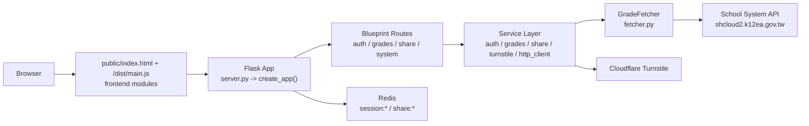
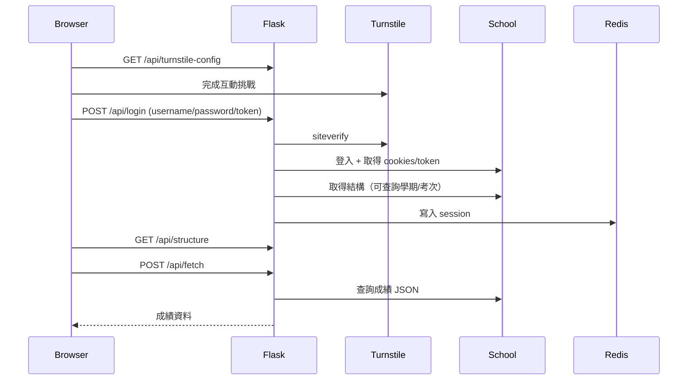
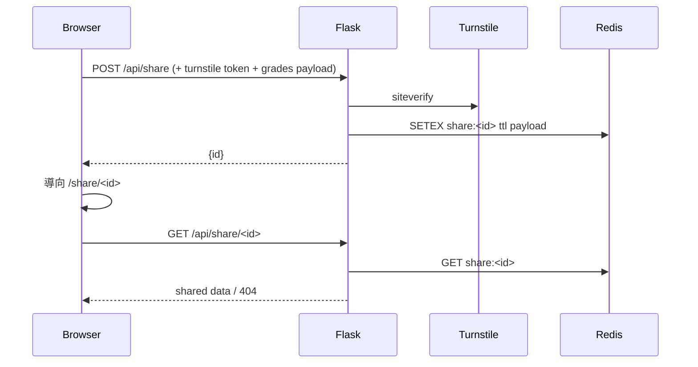

# 專案架構文件

最後更新時間：2026-03-22  

## 1. 專案定位與系統邊界

此專案提供「壢中學生成績查詢與分享成績」功能，核心流程為：

1. 使用者在前端輸入學校帳密並通過 Turnstile
2. 後端代為登入學校系統並取得 API token/cookies
3. 前端選擇學年度與考次，後端抓取成績 JSON
4. 前端將資料視覺化（卡片、表格、分佈、Chart.js）
5. 可建立短期分享連結（Redis TTL 到期失效）

系統邊界：

- 本系統只代理呼叫外部學校 API
- 本系統不做長期成績資料持久化（瀏覽器 localStorage + Redis TTL）

---

## 2. 整體架構（Runtime View）



---

## 3. 專案目錄與職責

```text
.
├── server.py                      # Flask 啟動入口（開發模式）
├── fetcher.py                     # 與學校系統整合的主要 adapter
├── app/
│   ├── __init__.py                # App factory、Session/CORS/Redis/Logger 初始化
│   ├── extensions.py              # Logger + CORS extension
│   ├── routes/
│   │   ├── auth.py                # 登入/檢查登入/登出
│   │   ├── grades.py              # 結構與成績查詢 API
│   │   ├── share.py               # 分享連結建立與讀取
│   │   └── system.py              # index/static/health/turnstile-config
│   └── services/
│       ├── auth_service.py
│       ├── grades_service.py
│       ├── share_service.py
│       ├── turnstile_service.py
│       └── http_client.py         # timeout/retry/cert 管理
├── frontend/                      # 前端原始碼（ES Modules）
│   ├── main.js
│   ├── style.css                  # 全域樣式（由 Vite 打包）
│   ├── storage.js
│   ├── sync.js
│   ├── share.js
│   ├── dashboard.js
│   ├── charts.js
│   ├── turnstile.js
│   ├── dialog.js                  # Modal 對話框元件
│   ├── onboarding.js              # 新手導覽主邏輯
│   ├── onboarding-bootstrap.js    # 新手導覽啟動器
│   ├── onboarding-events.js       # 新手導覽事件常數
│   ├── demo-data.js               # 示範資料
│   └── demo-mode.js               # 示範模式
├── public/                        # 靜態資源與 Vite build 輸出
│   ├── index.html
│   ├── privacy.html
│   ├── favicon.ico
│   ├── robots.txt
│   ├── sitemap.xml
│   └── dist/                      # Vite 產出（帶 hash 檔名）
├── scripts/                       # 建置輔助腳本
│   ├── inject-hash.js             # 注入 commit hash
│   └── inline_icons.py            # 內嵌 SVG 圖示
├── tests/                         # 自動化測試
├── Dockerfile
├── docker-compose.yml
└── .github/workflows/
    ├── deploy.yml                 # 正式環境部署
    ├── pr-ci.yml                  # PR 自動檢查
    └── debug_logs.yml             # 除錯日誌
```

---

## 4. 後端設計（Flask）

### 4.1 App Factory 與基礎設定

`app/__init__.py` 的 `create_app()` 負責：

- 建立 Flask app，並設定 `root_path` 使 `public/` 可被路由回傳
- 載入 `SECRET_KEY`
- Session cookie policy：`Secure=True`、`HttpOnly=True`、`SameSite=Lax`
- 設定 `MAX_CONTENT_LENGTH = 2MB`
- 初始化 Redis，並套用 `Flask-Session`（`SESSION_TYPE=redis`）
- 若 Redis 無法連線，退回 `SESSION_TYPE=null`（目前行為需特別注意，見風險章節）
- 註冊 CORS（`supports_credentials=True`，來源由 `CORS_ORIGINS` 控制）
- 注入 `GradeFetcher` 類別到 `app.config['GRADE_FETCHER']`
- 設定 `ProxyFix`、logger、blueprints

### 4.2 API 路由

| Route | Method | 用途 |
|---|---|---|
| `/api/check_login` | GET | 檢查 session 是否存在登入態 |
| `/api/login` | POST | Turnstile 驗證 + 學校系統登入 + session 寫入 |
| `/api/logout` | POST | 清除 session |
| `/api/structure` | GET | 取得可查詢學期/考次結構（支援 `reload=true`） |
| `/api/fetch` | POST | 依 `year_value` + `exam_value` 取成績 |
| `/api/share` | POST | 建立分享 ID 並寫入 Redis |
| `/api/share/<share_id>` | GET | 讀取分享內容 |
| `/share/<share_id>` | GET | 回傳 `public/index.html`（前端進入唯讀模式） |
| `/api/turnstile-config` | GET | 回傳 Turnstile site key |
| `/health` | GET | 健康檢查 |
| `/` 與 `/<path:filename>` | GET | 靜態頁入口與靜態檔案服務 |

### 4.3 Service Layer 分工

| Service | 核心責任 |
|---|---|
| `auth_service.py` | 呼叫 fetcher 登入並回傳 session payload |
| `grades_service.py` | 呼叫 fetcher 並過濾/縮減成績資料欄位 |
| `share_service.py` | 產生 share id、Redis 寫入與讀取 |
| `turnstile_service.py` | 呼叫 Cloudflare siteverify 驗證 token |
| `http_client.py` | 建立統一 requests session（timeout/retry/cert） |
| `rate_limiter.py` | API 請求頻率限制 |

### 4.4 外部系統整合（`fetcher.py`）

`GradeFetcher` 封裝對學校系統的所有互動：

- `_get_hidden_token(html)`：抽取 `__RequestVerificationToken`
- `login_and_get_tokens()`：登入頁 token -> login POST -> 成績頁 token -> 萃取 cookies
- `get_structure_via_api()`：取得年期清單，並平行抓各年期考次
- `get_exams_via_api()`：取得指定年期考次
- `fetch_grades_via_api()`：取得指定年期/考次成績內容

設計重點：

- 每次呼叫透過 `get_http_session()` 套用 timeout/retry/cert
- 以 `ThreadPoolExecutor` 平行抓取考次清單，加速結構讀取

---

## 5. 前端設計（Vite + Vanilla ES Modules）

### 5.1 載入與啟動

- 入口頁：`public/index.html`
- 載入模組：`<script type="module" src="/dist/main.js"></script>`
- `frontend/main.js` 在 `DOMContentLoaded` 依序啟動：
  - `checkDisclaimer()`
  - `loadTurnstileConfig()`
  - `loadGradesData()`
  - `setupSyncFeature()`
  - `setupShareFeature()`
  - `setupOnboardingBootstrap()`

### 5.2 前端模組責任

| 模組 | 職責 |
|---|---|
| `storage.js` | localStorage 讀寫、資料驗證、共享頁判斷前置 |
| `sync.js` | 登入 modal、查詢結構、抓成績、登出 |
| `share.js` | 分享 modal、建立/複製連結、共享頁唯讀模式 |
| `dashboard.js` | DOM 渲染（個資、統計、卡片、標準表、分佈） |
| `charts.js` | Chart.js 雷達圖與長條圖 |
| `turnstile.js` | site key 載入與 Turnstile widget 互動 |
| `dialog.js` | 統一 Modal 對話框（取代 alert/confirm） |
| `onboarding.js` | 新手導覽步驟與互動邏輯 |
| `onboarding-bootstrap.js` | 新手導覽啟動與狀態管理 |
| `onboarding-events.js` | 導覽事件常數定義 |
| `demo-data.js` | 示範用成績資料 |
| `demo-mode.js` | 示範模式切換 |

### 5.3 前端狀態儲存

- `localStorage.hasSeenDisclaimer`：免責聲明已讀狀態
- `localStorage.gradesData`：最近一次成績 JSON（前端渲染來源）
- `localStorage.hasSeenOnboarding`：新手導覽已讀狀態

---

## 6. 資料與狀態模型

### 6.1 Session（Server-side，Redis）

登入後 session 主要欄位：

- `username`
- `api_cookies`
- `student_no`
- `api_token`
- `structure`（可查詢結構快取）

### 6.2 Redis Key 設計

- `session:*`：Flask-Session 產生的 session 資料
- `share:<share_id>`：分享內容，TTL 預設 7200 秒（2 小時）

### 6.3 API 資料流

登入流程：



分享流程：



---

## 7. 建置與部署架構

### 7.1 前端建置

- `vite.config.js`：`root=frontend`，entry `frontend/main.js`
- build 輸出：`public/dist/`（帶 hash 檔名，如 `main-DMfxMjXw.js`）
- `public/index.html` 直接載入 `/dist/main-[hash].js`

### 7.2 Docker（多階段）

1. `node:20-slim` 建置前端（`npm run build`）
2. `python:3.11-slim` 安裝後端依賴
3. 複製專案碼與前端 build 輸出
4. 以 `gunicorn` 啟動：`server:app`

### 7.3 Compose 與生產拓撲

- `app`：Flask/Gunicorn 主服務
- `redis`：session 與分享資料
- `tunnel`：`cloudflared`（Cloudflare Tunnel）

### 7.4 CI/CD

- `.github/workflows/deploy.yml`：push `main` 觸發，`py_compile` 檢查、Build + Push image 到 GHCR、SSH 到 VPS 更新 Docker Swarm service
- `.github/workflows/pr-ci.yml`：PR 觸發，執行語法檢查與測試
- `.github/workflows/debug_logs.yml`：除錯用日誌收集


